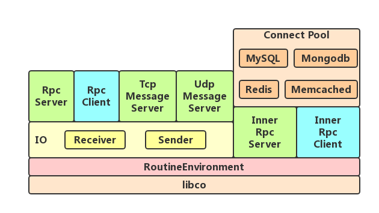

libcorpc
========
- Libcorpc is a high performance coroutine base RPC framework.
- Libcorpc is developed base on Tencent's libco(Some change has been maked to the libco and the changed source of libco is in the co directory).
- Using Google's protobuf to define RPC service.
- Send/Recv are handle in different IO threads, and multiple RPC requests can be send at the same times. 
- Libcorpc support interprocess and innerprocess RPC.
- Libcorpc support not only RPC service but also TCP/UDP message service.
- Libcorpc provide connect-pool access to MySQL/MongoDB/Redis/Memcached.
- Libcorpc can build in macOS and Linux.

***

### Architecture


***

### Proto
- Using google protobuf 2.6.1
- corpc_option.proto (It need to be imported from rpc service proto files)

```protobuf
import "google/protobuf/descriptor.proto";

package corpc;

extend google.protobuf.ServiceOptions {
    optional uint32 global_service_id = 10000;  // define service id
}

extend google.protobuf.MethodOptions {
    optional bool need_coroutine = 10002;       // start new coroutine to call the method
    optional bool not_care_response = 10003;    // care response or not
    optional uint32 timeout = 10004;            // rpc timeout duration, 0 means infinity
}

message Void {}
```

***

### HelloWorld
This example shows a simple way using libcorpc to develop. There are three files in the example: helloworld.proto, server.cpp and client.cpp.

- helloworld.proto

```protobuf
import "corpc_option.proto";

option cc_generic_services = true;

message FooRequest {
    required string msg1 = 1;
    required string msg2 = 2;
}

message FooResponse {
    required string msg = 1;
}

service HelloWorldService {
    option (corpc.global_service_id) = 1;

    rpc foo(FooRequest) returns(FooResponse);
}
```

The "helloworld.proto" file define a rpc service "HelloWorldService" with a rpc method "foo". The method has an argument with "FooRequest" message type and the return value type is "FooResponse"

- server.cpp

```server
#include "corpc_routine_env.h"
#include "corpc_rpc_server.h"

#include "helloworld.pb.h"

using namespace corpc;

class HelloWorldServiceImpl : public HelloWorldService {
public:
    HelloWorldServiceImpl() {}
    virtual void foo(::google::protobuf::RpcController* controller,
                     const ::FooRequest* request,
                     ::FooResponse* response,
                     ::google::protobuf::Closure* done) {
        std::string msg1 = request->msg1();
        std::string msg2 = request->msg2();
        
        response->set_msg(msg1 + " " + msg2);
    }
};

int main(int argc, const char * argv[]) {
    co_start_hook();
    
    if(argc<3){
        LOG("Usage:\n"
               "HelloWorldServer [IP] [PORT]\n");
        return -1;
    }
    
    std::string ip = argv[1];
    unsigned short int port = atoi(argv[2]);
    
    IO *io = IO::create(1, 1); // create IO layer for recv&send
    
    RpcServer *server = RpcServer::create(io, 0, ip, port);
    
    HelloWorldServiceImpl *helloWorldService = new HelloWorldServiceImpl();
    server->registerService(helloWorldService);
    
    RoutineEnvironment::runEventLoop();
}
```

The "server.cpp" file is a server implementation which show how to implement a rpc server. 
The server implementation create a IO object before create the RpcServer object. The IO object is responsible for recv and send data efficiently. The RpcServer is responsible for providing rpc service in certain address by register a rpc service (HelloWorldServiceImpl) to the RpcServer. The "HelloWorldServiceImpl" class implement HelloWorldService, it combine msg1 and msg2 string from the request and return result by the response.

- client.cpp

```client
#include "corpc_routine_env.h"
#include "corpc_rpc_client.h"
#include "corpc_controller.h"
#include "helloworld.pb.h"

using namespace corpc;

static void *helloworld_routine( void *arg )
{
    co_enable_hook_sys();
    
    HelloWorldService::Stub *helloworld_clt = (HelloWorldService::Stub *)arg;
    
    FooRequest *request = new FooRequest();
    FooResponse *response = new FooResponse();
    Controller *controller = new Controller();
    
    request->set_msg1("Hello");
    request->set_msg2("World");
    
    helloworld_clt->foo(controller, request, response, NULL);
    
    if (controller->Failed()) {
        ERROR_LOG("Rpc Call Failed : %s\n", controller->ErrorText().c_str());
    } else {
        LOG(response->msg().c_str());
    }
    
    delete controller;
    delete response;
    delete request;
    
    return NULL;
}

int main(int argc, const char * argv[]) {
    co_start_hook();
    
    if(argc<3){
        LOG("Usage:\n"
               "HelloWorldClient [HOST] [PORT] [NUM]\n");
        return -1;
    }
    
    std::string host = argv[1];
    unsigned short int port = atoi(argv[2]);
    
    IO *io = IO::create(1, 1); // create IO layer for recv&send
    
    RpcClient *client = RpcClient::create(io);
    RpcClient::Channel *channel = new RpcClient::Channel(client, host, port, 1);
    HelloWorldService::Stub *helloworld_clt = new HelloWorldService::Stub(channel);
    
    RoutineEnvironment::startCoroutine(helloworld_routine, helloworld_clt);
    
    RoutineEnvironment::runEventLoop();
}

```

The "client.cpp" file is the client side implementation which show how to call rpc server from rpc client. The client implementation also create an IO object, a RpcClient base on the IO object, a rpc channal connect to the rpc server and then create the service stub object base on the rpc channel. The rpc method "foo" can be call by the stub object. In this example it create a coroutine to call rpc.

***

### tutorial
- Tutorial1: a simple hello world example
- Tutorial2: add a middle RPC server on the base of Tutorial1
- Tutorial3: show how to use the "need_coroutine" option
- Tutorial4: innerprocess RPC
- Tutorial5: recursive RPC call between two RPC servers to calculate factorial value

***

### benchmark
- Environment：a MacBook Pro, macOS 10.12.6, cpu: 2.6GHz i5 
- Interprocess RPC benchmark：example/example_interRpc, average 75000+ rpc per second
- Innerprocess RPC benchmark：example/example_innerRpc，average 200000+ rpc per second

***

### build
- Need GCC 4.8.3 or later
- Need cmake（btw, 'libcorpc.xcworkspace' can be used In MacOS Xcode）
- Install libco library
```libco
$ cd co && mkdir build && cd build && cmake .. && make install && cd ../..
```
- Install libcorpc library（need libprotobuf 2.6）
```libcorpc
$ cd corpc && mkdir build && cd build && cmake .. && make install && cd ../..
```
- Base on needs install libcorpc_memcached library（need libmemcached 1.0）
```libcorpc_memcached
$ cd corpc_memcached && mkdir build && cd build && cmake .. && make install && cd ../..
```
- Base on needs install libcorpc_mongodb library（need libmongoc-1.0 and libbson-1.0）
```libcorpc_mongodb
$ cd corpc_mongodb && mkdir build && cd build && cmake .. && make install && cd ../..
```
- Base on needs install libcorpc_redis library（need libhiredis）
```libcorpc_redis
$ cd corpc_redis && mkdir build && cd build && cmake .. && make install && cd ../..
```
- Base on needs install libcorpc_mysql library（need libmysqlclient）
```libcorpc_mysql
$ cd corpc_mysql && mkdir build && cd build && cmake .. && make install && cd ../..
```
- Build tutorials
```tutorial
$ cd tutorial/tutorial1 && mkdir build && cd build && cmake .. && make && cd ../../..
$ cd tutorial/tutorial2 && mkdir build && cd build && cmake .. && make && cd ../../..
$ cd tutorial/tutorial3 && mkdir build && cd build && cmake .. && make && cd ../../..
$ cd tutorial/tutorial4 && mkdir build && cd build && cmake .. && make && cd ../../..
$ cd tutorial/tutorial5 && mkdir build && cd build && cmake .. && make && cd ../../..
```
- Build Examples
```example
$ cd example/example_interRpc && mkdir build && cd build && cmake .. && make && cd ../../..
$ cd example/example_innerRpc && mkdir build && cd build && cmake .. && make && cd ../../..
$ cd example/example_echoTcp && mkdir build && cd build && cmake .. && make && cd ../../..
$ cd example/example_echoUdp && mkdir build && cd build && cmake .. && make && cd ../../..
$ cd example/example_memcached && mkdir build && cd build && cmake .. && make && cd ../../..
$ cd example/example_mongodb && mkdir build && cd build && cmake .. && make && cd ../../..
$ cd example/example_mysql && mkdir build && cd build && cmake .. && make && cd ../../..
$ cd example/example_redis && mkdir build && cd build && cmake .. && make && cd ../../..
```

***

### Notice
- When using third party library(E.g. MySQL,MongoDB,Redis,Memcached,etc), add "LD_PRELOAD=<libco library path>"(Linux) or “DYLD_INSERT_LIBRARIES=<libco library path> DYLD_FORCE_FLAT_NAMESPACE=y”(MacOS) to start program.

