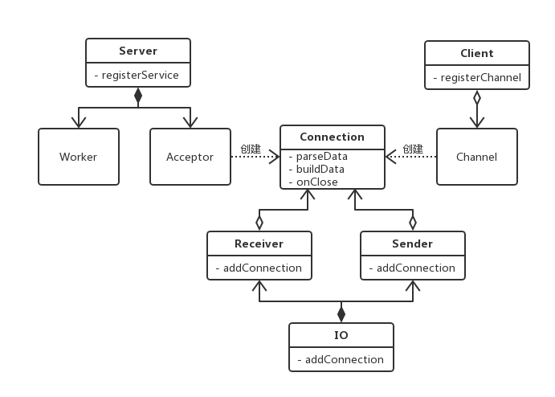

libcorpc
========
- 在腾讯开源项目libco基础上开发，拥有libco的特性
- 开发过程中对libco做了少量修改，在项目的co目录中
- 使用protobuf定义rpc服务和方法
- 支持进程间和进程内的rpc
- 结合了协程和rpc的特点，进行rpc调用时不用担心阻塞线程执行，提升线程使用效率
- 为非rpc数据传输提供了Tcp/Udp消息服务：TcpMessageServer和UdpMessageServer
- RpcClient和InnerRpcClient实现是线程安全的，可在主线程创建对象然后在多个线程中并发调用rpc
- 全双工模式的RPC框架，比连接池实现方式效率更高且需要连接数更少
- 目前支持macOS和linux系统

***

### 架构图


TODO: 架构部件介绍
***

### 类图


TODO: 类介绍
***

### proto
- 采用google protobuf 2.6.1
- corpc_option.proto

```protobuf
import "google/protobuf/descriptor.proto";

package corpc;

extend google.protobuf.ServiceOptions {
    optional uint32 global_service_id = 10000;  // 用于定义每个service的id
}

extend google.protobuf.MethodOptions {
    optional bool need_coroutine = 10002;       // 是否新开协程执行方法
    optional bool not_care_response = 10003;    // 是否关心结果，若不关心结果，则相当于单向消息发送且不知道对方是否成功接收
}

message Void {}
```

- 定义rpc服务proto文件时，需要先 import "corpc_option.proto";

- global_service_id为每个service定义id，注册到同一个CoRpc::Server中的service的id不能重复
- need_coroutine设置是否启动新协程来调用rpc服务实现方法，默认为false（tutorial3和tutorial5有关于该选项的用例）
- not_care_response设置为true时相当于单向消息传递，默认为false
- 例子：helloworld.proto

```protobuf
import "corpc_option.proto";

option cc_generic_services = true;

message FooRequest {
    required string msg1 = 1;
    required string msg2 = 2;
}

message FooResponse {
    required string msg = 1;
}

service HelloWorldService {
    option (corpc.global_service_id) = 1;

    rpc foo(FooRequest) returns(FooResponse);
}
```

***

### tutorial
- Tutorial1:一个简单的Hello World例子
- Tutorial2:在Tutorial1基础上加一个中间服务器
- Tutorial3:proto定义中“need_coroutine”选项的使用
- Tutorial4:进程内RPC
- Tutorial5:服务器间递归调用

***

### benchmark
- 测试环境：MacBook Pro, macOS 10.12.6, cpu: 2.6GHz i5, 一台机器
- 进程间rpc调用benchmark程序：example/example_interRpc，在一台机器中测试，平均每秒8万+次rpc
- 进程内rpc调用benchmark程序：example/example_innerRpc，平均每秒30万+次

***

### build
- 需要GCC 4.8.3以上版本

***

### 使用libcorpc开发一些要注意的地方
- socket族IO操作、某些第三方库函数（如：mysqlclient）、sleep方法、co_yield_ct方法等会产生协程切换
- 协程的切换实际是掌握在程序员手中
- 一个线程中的多个协程对线程资源的访问和修改不需要对资源上锁
- 如果一协程中有死循环并且循环中没有能产生协程切换的方法调用，其他协程将不会被调度执行
- socket族IO操作会有fd在epoll中进行事件监听，而sleep没有fd在epoll中监听，如果一段时间内没有fd事件发生，需要等epoll超时之后sleep协程才会被唤醒，因此epoll超时值需要根据实际情况进行设置，超时值太小会消耗性能，太大则sleep唤醒延迟大
- 在使用第三方库时（如：mysqlclient），需要在启动程序时加上“LD_PRELOAD=<path of libco>”（如果在mac OS中加“DYLD_INSERT_LIBRARIES=<HOOK了系统接口的动态库> DYLD_FORCE_FLAT_NAMESPACE=y”）

